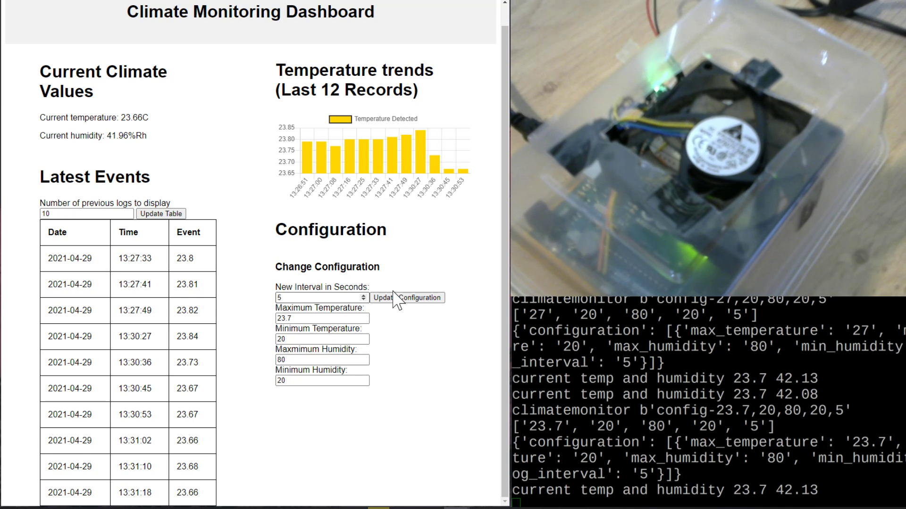
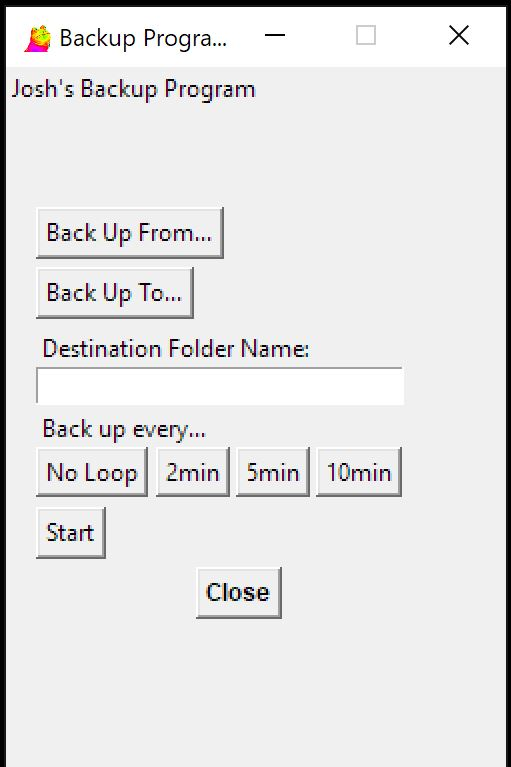

## Projects:

### Robotics

#### Dog Feeder </img> </img> </img> </img>
</img>

Univeristy project creating an IOT dog bowl.
Using a variery of technologies to log and communicate eating habits.
#### Greenhouse monitor </img> </img> </img> </img>
</img>

Dissertation project, an internet-of-things greenhouse climate monitoring and control system featuring a web interface and mobile push notifications.
### Games

#### Flappy Duck </img>
</img>

Built with Python and Pygame, a shameless clone of flappy bird I made in high-school
#### Yahtzee </img>
</img>

Written in C++ with SFML. 
### Utilites

#### Backup GUI </img>
</img>

A program I wrote to learn Tkinter and GUIs in Python.
### Webscraping

#### Yt-Crawler </img>

#### TT-Extractor </img>

Uses Python and Playwright to extract metadata from TikTok profiles and record relationships between users.
#### TandFOnline </img>

Reverse-engineered their internal API to pull 20k articles.
Created to build a dataset of technical writings and their tags/classifications. 

