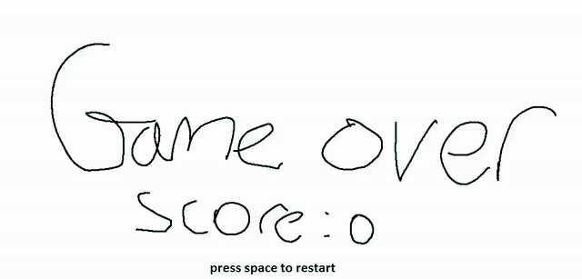
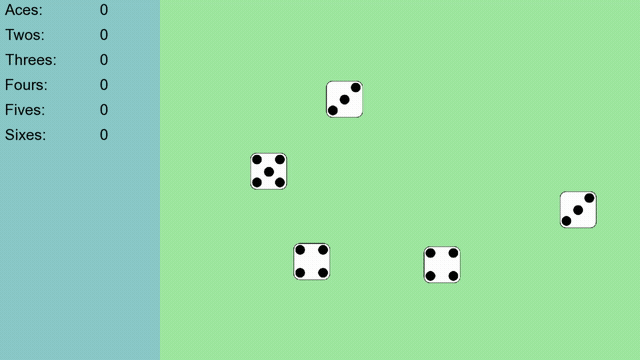

## Projects:

### Robotics

#### Dog Feeder </img> </img> </img> </img>

#### Greenhouse monitor </img> </img> </img> </img>

### Games

#### Flappy Duck </img>
</img>

#### Yahtzee </img>
</img>

### Utilites

#### Backup GUI </img>
</img>

### Webscraping

#### Yt-Crawler </img>

#### TT-Extractor </img>

#### TandFOnline </img>