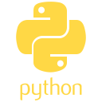

## Projects:

### Robotics

#### Dog Feeder
</img>
</img>
</img>

#### Greenhouse monitor
</img>
</img>
</img>

### Games

#### Flappy Duck
</img>

#### Yahtzee

</img>

### Utilites

#### Backup GUI
</img>

#### Yt-Crawler
</img>

<!--
**joshuafarren/joshuafarren** is a ✨ _special_ ✨ repository because its `README.md` (this file) appears on your GitHub profile.

Here are some ideas to get you started:

- 🔭 I’m currently working on ...
- 🌱 I’m currently learning ...
- 👯 I’m looking to collaborate on ...
- 🤔 I’m looking for help with ...
- 💬 Ask me about ...
- 📫 How to reach me: ...
- 😄 Pronouns: ...
- ⚡ Fun fact: ...
-->
